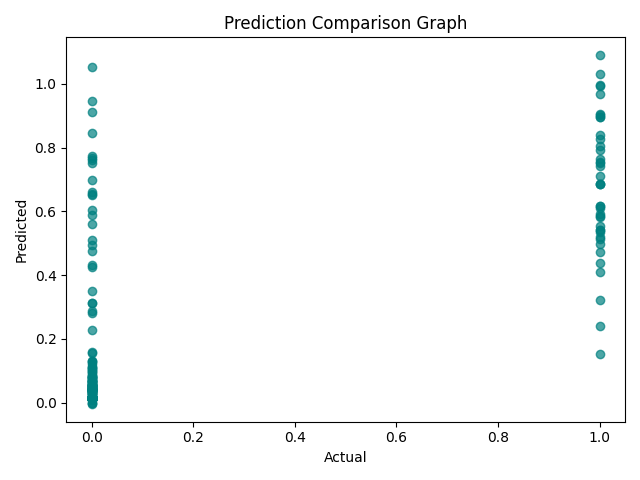

# 🩺 MediScan — AI-Powered Disease Outbreak Prediction & Health Risk Monitoring System

**MediScan** is an AI-driven epidemic forecasting and health-risk monitoring platform that predicts infectious disease outbreaks based on climate, hospital, and environmental sensor data.  
This version uses a **Hybrid AIS + CSA (Artificial Immune System + Crow Search Algorithm)** optimizer to fine-tune CNN + LSTM model hyperparameters for accurate outbreak prediction.

---

## 🧭 Overview

Traditional health-surveillance systems are reactive, providing information only after an outbreak has begun.  
MediScan shifts this paradigm by integrating **IoT health sensors**, **weather patterns**, and **machine-learning forecasts** to provide **early-warning risk maps** and **proactive decision support** for healthcare authorities.

---

## 💡 Key Objectives

| Problem | AI-Powered Solution |
|----------|--------------------|
| Manual outbreak reporting is slow | Real-time predictive modeling via CNN + LSTM |
| Epidemiological models lack adaptability | Hybrid AIS + CSA optimizer for dynamic tuning |
| Limited correlation between climate & disease | Multi-source climate–disease feature fusion |
| Delayed response to outbreaks | Early warning system (+7 day forecast window) |

---

## ⚙️ Tech Stack

| Layer | Technology |
|--------|-------------|
| **Data Handling** | Pandas · NumPy · Scikit-learn |
| **Modeling** | TensorFlow · Keras (CNN + LSTM fusion) |
| **Optimization** | Hybrid Artificial Immune System + Crow Search Algorithm |
| **Visualization** | Matplotlib · Seaborn |
| **Deployment (optional)** | FastAPI · Streamlit |
| **Hardware Layer (optional)** | ESP32 + Temperature, Air Quality, Heart-Rate Sensors |

---

## 🧩 Architecture Workflow

Data Collection → Pre-processing → CNN-LSTM Fusion Model
↓ ↓
Climate, Hospital, IoT Hybrid AIS + CSA Optimizer
↓ ↓
Model Training → Evaluation → Visualization Dashboard

yaml
Copy code

**Hybrid AIS + CSA Optimizer**

| Phase | Description |
|--------|-------------|
| **AIS (Exploration)** | Generates diverse “antibody” solutions via mutation & cloning. |
| **CSA (Exploitation)** | Refines top solutions by modeling crow memory-following behavior. |
| **Hybridization** | Combines AIS exploration and CSA exploitation for fast convergence and high accuracy. |

---

## 📂 Dataset Used

**File:**  
C:\Users\NXTWAVE\Downloads\Disease Outbreak Prediction & Health Risk Monitoring System\archive\Weather-related disease prediction.csv

css
Copy code

**Sample Columns:**  
Temperature, Humidity, Rainfall, Mosquito_Count, Infection_Rate, Population_Density, Hospital_Cases, Outbreak_Level

yaml
Copy code

All numeric features are scaled using **Min-Max Normalization**, and missing values are dropped before training.

---

## 🧠 Model Details

- **Architecture:** CNN + LSTM hybrid  
- **Optimizer:** Hybrid AIS + CSA (custom-coded)  
- **Loss Function:** Mean Squared Error (MSE)  
- **Metrics:** MAE, RMSE, R² Score  
- **Training:** 80 % training, 20 % testing split  

### CNN + LSTM Fusion

| Component | Function |
|------------|-----------|
| **CNN Block** | Learns spatial correlations among features. |
| **LSTM Block** | Captures temporal dependencies in outbreak trends. |
| **Dense + Dropout** | Fully-connected layer with regularization. |

---

## 📊 Optimization Process

| Parameter | Range |
|------------|-------|
| Learning Rate | 1e-4 → 1e-2 |
| Dropout Rate | 0.1 → 0.5 |
| LSTM Units | 16 → 128 |
| Epochs (for evaluation) | 40 |
| Population Size | 5 |
| Iterations | 4 |

The hybrid algorithm alternates between:
- **AIS mutation cloning** → exploration of new parameter sets  
- **CSA awareness mechanism** → convergence toward global best  




---

## 💾 Expected Outputs

All outputs are saved under:

C:\Users\NXTWAVE\Downloads\Disease Outbreak Prediction & Health Risk Monitoring System

yaml
Copy code

| File Name | Description |
|------------|-------------|
| `hybrid_medican_model.keras` | Trained CNN + LSTM model |
| `hybrid_medican_scaler.pkl` | Feature scaler object |
| `hybrid_medican_config.yaml` | Optimizer configuration |
| `hybrid_medican_prediction.json` | Best parameters + evaluation metrics |
| `hybrid_medican_result.csv` | Actual vs. Predicted outbreak levels |
| `visuals/hybrid_medican_loss_graph.png` | Training & validation loss curve |
| `visuals/hybrid_medican_comparison_graph.png` | Actual vs. predicted scatter plot |
| `visuals/hybrid_medican_heatmap.png` | Correlation heatmap |

---

## 📈 Performance Metrics

| Metric | Description | Target |
|---------|--------------|---------|
| **MAE** | Mean Absolute Error | ≤ 0.06 |
| **RMSE** | Root Mean Squared Error | ≤ 0.10 |
| **R² Score** | Model generalization accuracy | ≥ 0.90 |
| **Forecast Lead Time** | Early prediction window | + 7 days |

---

## 🎨 Visualizations

1. **Training & Validation Loss Graph**
   - Displays convergence during training.
2. **Prediction Comparison Graph**
   - Shows alignment between true and predicted outbreak levels.
3. **Correlation Heatmap**
   - Highlights the linear relationship between predicted vs. actual data.

---

## 🚀 How to Run

### 1️⃣ Prerequisites
Install required dependencies:
```bash
pip install tensorflow numpy pandas scikit-learn matplotlib seaborn pyyaml joblib
2️⃣ Run the MediScan Script
bash
Copy code
python hybrid_medican_pipeline.py
3️⃣ Output Location
Check the following folder for results:

markdown
Copy code
Disease Outbreak Prediction & Health Risk Monitoring System\
    ├── hybrid_medican_model.keras
    ├── hybrid_medican_result.csv
    ├── visuals\
          ├── hybrid_medican_loss_graph.png
          ├── hybrid_medican_comparison_graph.png
          └── hybrid_medican_heatmap.png
🌍 Impact
🧭 Predicts disease outbreaks before escalation.

🌦️ Integrates climate + hospital + mobility analytics.

🏥 Assists public health departments with real-time insights.

🛰️ Scalable for regional or global deployment.

💡 Extensible with federated learning for global health networks.

🔮 Future Enhancements
Integrate Twitter/X symptom sentiment analysis.

Connect with WHO / Google Mobility APIs for real-time data.

Add GenAI-based automatic outbreak summary generation.

Expand to federated global disease network (FL-MediScan).

Include Edge AI inference on hospital gateways (ESP32/Jetson Nano).

🧾 Naming Convention
All output artifacts use the following prefix:

nginx
Copy code
hybrid_medican_
Examples:

hybrid_medican_model.keras

hybrid_medican_result.csv

hybrid_medican_comparison_graph.png

📘 Author & Credits
Developed by:
Sagnik Patra
